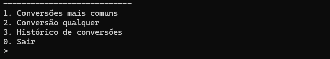
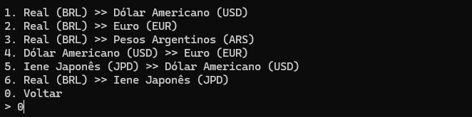
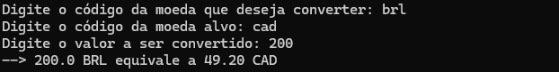
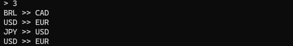

# 💰 Conversor de Moedas
É um programa em console que recebe e envia através do prompt de comando para fazer a conversão de unidades monetárias em tempo real usando a API gratuita Exchange Rate.

## 1️⃣ Conversões comuns
Apresenta um submenu com 6 opções de conversão de moedas mais comuns.

## 2️⃣ Faça qualquer conversão
Se deseja fazer alguma conversão que não está entre as mais comuns é possível fazer a conversão apenas informando os códigos das moedas.

## 3️⃣ Histórico
Permite visualizar as últimas conversões que foram feitas.

